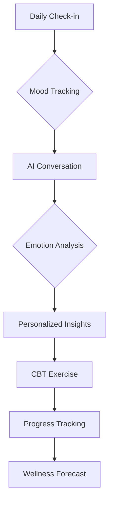

# 🚀 Velness: Revolutionizing Mental Health with AI

[](https://github.com/DataScyther/Velness/releases)
[](https://opensource.org/licenses/MIT)
[](http://makeapullrequest.com)
[](https://nodejs.org/)
[](https://reactjs.org/)
[](https://www.typescriptlang.org/)
[](https://vitejs.dev/)

---

# Velness

A conversational AI project exploring mood tracking, reflective journaling, and CBT-inspired exercises using modern LLM tooling.

> This project is **not a medical product** and does not provide diagnosis, therapy, or crisis support.  
> It is an experimental software project focused on human-computer interaction and behavioral self-reflection tools.

## Vision

> *"Empowering minds through AI-driven mental wellness – where technology meets compassion."*

Velness represents the future of mental health support, seamlessly blending cutting-edge artificial intelligence with evidence-based therapeutic practices. Designed for proactive emotional maintenance and intelligent crisis intervention, our platform transforms how individuals engage with their mental well-being.

---

## Table of Contents

- Vision
- Core Features
- Technology Stack
- Quick Start
- Usage Guide
- Documentation
- Development
- Contributing
- License
- Support
- Live Demo

---

## Purpose

Most mental wellness apps either:

- track data but don’t talk to you
- or talk to you but don’t remember anything meaningful

Velness prototypes a middle ground:  
a personal conversational interface that helps users notice patterns in thoughts, habits, and emotions over time.

The focus is behavioral awareness, not treatment.

---

## Current Status

⚠️ Active development project

Features are experimental and subject to change.  
Expect incomplete flows, placeholder logic, and evolving architecture.

---

## Core Features

| Feature | What it actually does |
|------|------|
| Conversational Companion | Natural language chat interface for reflection and journaling prompts |
| Mood Tracking | Stores daily mood entries and simple trends |
| Pattern Insights | Detects recurring keywords, topics, and emotional tone changes |
| CBT-Inspired Exercises | Structured reflection prompts based on cognitive restructuring principles (non-clinical) |

---

## Technology Stack

- React + Vite frontend
- Node.js backend
- TypeScript
- LLM powered conversation layer
- Local data storage (session-based memory)

---

## What This Project Is

- A learning project
- An HCI + AI experimentation sandbox
- A behavioral journaling assistant
- A portfolio-grade full-stack AI application

## What This Project Is NOT

- A therapist
- A diagnosis system
- A crisis intervention service
- A replacement for professional help

---

## Planned Improvements

- Long-term memory summarization
- Better prompt engineering for reflections
- Habit correlation detection
- Privacy-first storage architecture
- Response quality evaluation dataset

---

## Why This Exists

Modern LLMs are good at conversation but bad at continuity.  
Mental wellness tools need continuity more than intelligence.

This project experiments with combining:

conversation + memory + pattern tracking

to see whether software can help users notice their own behavioral patterns earlier.

---

## Core Features (In Development)

| Feature | Description | Impact |
|---------|-------------|---------|
| 🤖 **AI Mental Health Companion** | Natural language conversations with an empathetic AI therapist | 24/7 personalized emotional support |
| 📊 **Advanced Mood Analytics** | AI-powered pattern recognition and predictive insights | Proactive mental health management |
| 🧠 **Intelligent CBT Engine** | Adaptive cognitive behavioral therapy exercises | Scientifically-backed therapeutic interventions |
| 👥 **Community Intelligence** | Anonymous peer support with AI-moderated discussions | Safe, meaningful social connections |
| 🚨 **Crisis Detection System** | Real-time emergency response with professional escalation | Life-saving crisis intervention |
| 🧘 **AI-Guided Meditation** | Personalized mindfulness sessions with biofeedback | Enhanced stress reduction and relaxation |

---

## 🛠 Technology Stack (Detailed)

### Frontend Architecture

- **⚡ Vite 6.0** - Lightning-fast build tool and dev server
- **⚛️ React 18** - Modern component-based UI framework
- **🔷 TypeScript 5.0** - Type-safe JavaScript for robust development
- **🎨 Tailwind CSS** - Utility-first CSS framework for rapid styling
- **🎭 Radix UI** - Accessible, unstyled UI primitives
- **✨ Shadcn/ui** - Beautiful, customizable component library

### AI & Backend Infrastructure

- **🌟 NVIDIA NIM API** - High-performance LLMs (Llama 3.3 Nemotron)
- **🗄️ Firebase** - Real-time database with built-in authentication
- **🚀 Node.js** - High-performance backend runtime

### Cross-Platform Deployment

- **📱 Capacitor** - Native mobile app development
- **☁️ Vercel** - Global CDN with automated deployments
- **🔄 CI/CD** - Automated testing and deployment pipelines

---

## 🚀 Quick Start

### Prerequisites

- **Node.js** 18+ ([Download](https://nodejs.org/))
- **npm** or **pnpm** (recommended for speed)
- **Git** for version control

### Installation

1. **Clone the Repository**

   ```bash
   git clone https://github.com/DataScyther/Velness.git
   cd Velness
   ```

2. **Install Dependencies**

   ```bash
   npm install
   # or for faster installs
   pnpm install
   ```

3. **Environment Setup**

   ```bash
   cp .env.example .env
   # Edit .env with your API keys
   ```

4. **Launch Development Server**

   ```bash
   npm run dev
   ```

5. **Access the Application**

   - Open [http://localhost:5173](http://localhost:5173) in your browser
   - Experience the future of mental health technology!

---

## 📖 Usage Guide

### First-Time Setup

1. **Complete Onboarding** - Personalized mental health assessment
2. **Configure Preferences** - Customize your wellness journey
3. **Grant Permissions** - Enable notifications and data access

### Daily Workflow



### Key Interactions

- **💬 Chat Interface**: Natural conversations with Velness
- **❤️ Mood Logging**: Quick emotional state recording
- **📈 Dashboard**: Visual analytics and trend analysis
- **🎯 Exercises**: Guided therapeutic activities
- **👥 Community**: Anonymous peer support groups

---

## Documentation

- Project Synopsis: [docs/Project_Synopsis.md](docs/Project_Synopsis.md)
- Requirements & Methodology: [docs/Requirements_and_Methodology.md](docs/Requirements_and_Methodology.md)
- Future Scope & References: [docs/Future_Scope_and_References.md](docs/Future_Scope_and_References.md)
- Velness Emotion System (design + usage): [docs/EMOTION_SYSTEM.md](docs/EMOTION_SYSTEM.md)
- Velness Emotion System (API reference): [docs/EMOTION_SYSTEM_API.md](docs/EMOTION_SYSTEM_API.md)

> **Sprint — Velness Emotion System:** Replace all Unicode emojis with a single reusable, animated, brand-consistent `EmotionAvatar` component (Light/Dark, 60 FPS via `react-native-reanimated`).

---

## 🔧 Development

### Project Structure

```text
Velness/
├── src/
│   ├── components/     # React components
│   ├── hooks/         # Custom React hooks
│   ├── lib/           # Utility libraries
│   ├── utils/         # Helper functions
│   └── supabase/      # Database integration
├── backend/           # Node.js API server
├── android/           # Native Android app
├── docs/             # Documentation
└── public/           # Static assets
```

### Available Scripts

```bash
npm run dev          # Start development server
npm run build        # Build for production
npm run preview      # Preview production build
npm run deploy:netlify # Deploy to Netlify
```

### Environment Variables

```env
# Server-side only (never expose to frontend)
NVIDIA_API_KEY=your_nvidia_api_key
```

---

## Live Demo

The application is deployed and accessible at: [https://velness-demo.example.com](https://velness-demo.example.com)

### Deployment Setup

To deploy this application:

1. Run `npm run build` to create a production build
2. Deploy the `dist` folder to your hosting platform
3. For GitHub Pages:
   - Set base path in `vite.config.js`:

     ```js
     export default {
       base: '/your-repo-name/',
       // ... other config
     }
     ```

   - Add deployment script to `package.json`:

     ```json
     "scripts": {
       "predeploy": "npm run build",
       "deploy": "gh-pages -d dist"
     }
     ```

---

## Contributing

We welcome contributions from developers, mental health professionals, and AI researchers!

### How to Contribute

1. **Fork** the repository
2. **Create** a feature branch: `git checkout -b feature/amazing-feature`
3. **Commit** your changes: `git commit -m 'Add amazing feature'`
4. **Push** to the branch: `git push origin feature/amazing-feature`
5. **Open** a Pull Request

### Development Guidelines

- 🔒 **Security First**: All contributions undergo security review
- 🧪 **Testing**: Write tests for new features
- 📚 **Documentation**: Update docs for API changes
- 🎨 **UI/UX**: Follow design system guidelines
- 🚀 **Performance**: Optimize for speed and accessibility

---

## 📄 License

**MIT License** - Open source and free to use, modify, and distribute.

```text
Copyright (c) 2025 DataScyther

Permission is hereby granted, free of charge, to any person obtaining a copy
of this software and associated documentation files (the "Software"), to deal
in the Software without restriction, including without limitation the rights
to use, copy, modify, merge, publish, distribute, sublicense, and/or sell
copies of the Software...
```

---

## Support & Community

### Get Help

- 🐛 **Bug Reports**: [GitHub Issues](https://github.com/DataScyther/Velness/issues)
- 💡 **Feature Requests**: [GitHub Discussions](https://github.com/DataScyther/Velness/discussions)
- 💬 **Community Chat**: Join our Discord server
- 📧 **Professional Support**: [support@velness.app](mailto:support@velness.app)

### Crisis Resources

If you're experiencing a mental health crisis:

- 🇮🇳 **India**: Call 9152987821 (AASRA)
- 🌍 **International**: Contact local emergency services
- 🚨 **Velness Crisis Mode**: Available 24/7 within the app

---

## 🙏 Acknowledgments

"Technology should serve humanity's deepest needs – emotional well-being is fundamental."

---

Experience the future of mental health care. Download Velness today and start your journey toward better mental wellness. 🌟
